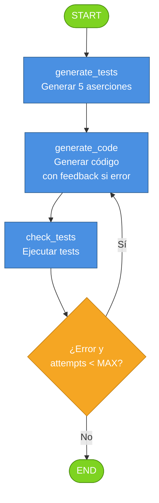

Ejercicio 3: TDD con LangGraph

Descripción

- Sistema agéntico basado en Test-Driven Development (TDD) usando **LangGraph** para orquestar el flujo de estados.
- Usa la API HTTP de **Ollama Cloud** (`/api/chat`) para generar tests y código.
- Dados una especificación HumanEval, el sistema genera tests (mediante un LLM), después genera código (mediante otro LLM), ejecuta los tests, y repite hasta que pasen todos o se alcance máximo de intentos.
- Soporta autenticación por Bearer token para servicios cloud.

Arquitectura con LangGraph

- **Estado (TDDState):** TypedDict con campos: `spec` (especificación), `tests_source` (tests generados), `code` (código generado), `last_error` (error o ""), `attempts` (contador), `history` (historial), `error_counts` (conteo por tipo de error), `error_history` (errores recientes), `best_code` y `best_passed`.
- **Nodos:**
  - `generate_tests`: Genera 5 aserciones una sola vez (attempts = 0).
  - `generate_code`: Genera implementación; si hay error previo, lo incluye como feedback al LLM.
  - `check_tests`: Ejecuta tests y captura errores (compilación, assertions).
- **Aristas condicionales:**
  - START → `generate_tests` → `generate_code` → `check_tests`.
  - `check_tests` → `generate_code` (si error y attempts < MAX_ATTEMPTS) o END (si OK o MAX_ATTEMPTS).
- **Routing:** `route_after_check()` decide si reintentar o terminar basándose en errores y contador de intentos.

Grafo TDD con LangGraph



Ejecución rápida

**Pasos (Ollama Cloud únicamente):**

1. **Crear entorno e instalar dependencias**

```bash
python3 -m venv .venv
source .venv/bin/activate
python -m pip install -r ejercicio3-langgraph/requirements.txt
```

2. **Configurar variables de entorno (obligatorio para cloud)**

```bash
export OLLAMA_BASE_URL="https://ollama.com"
export OLLAMA_API_KEY="tu_api_key_aqui"
export TESTS_MODEL="gpt-oss:120b-cloud"
export CODE_MODEL="qwen3-coder:480b-cloud" 
export HUMANEVAL_SAMPLE_SIZE=1
export MAX_ATTEMPTS=5
export HUMANEVAL_SEED=42   # Opcional: fija la muestra; si no se define, es aleatoria
```

3. **Ejecutar el script**

```bash
python ejercicio3-langgraph/tdd_langgraph.py
```

Notas de ejecución

- **API Key requerida para ollama.com:** Asegúrate de que `OLLAMA_API_KEY` esté configurada.
- **Autenticación:** el script envía `Authorization: Bearer {API_KEY}` directamente en cada llamada a `/api/chat`.
- **Modelos disponibles en ollama.com:** Usa los identificadores provistos por el servicio (ej. `gpt-oss:120b-cloud`).
- **Tiempo de ejecución:** Depende de la latencia de la red; puede tardar varios minutos por tarea.
- **Archivos de salida:** Se guardan en `ejercicio3-langgraph/`:
  - `history_{task_id}.json`: Historial detallado de intentos
  - `summary_{task_id}.json`: Resumen por tarea
  - `summary.json`: Agregado de todas las tareas
- **Selección HumanEval:** por defecto es aleatoria; si quieres reproducibilidad, define `HUMANEVAL_SEED`.

Modelo recomendado para tests

- **Recomendado:** `gpt-oss:120b-cloud` para `TESTS_MODEL`.
- Motivo: mejor capacidad de razonamiento para proponer asserts consistentes y evitar tests ambiguos.
- El prompt de tests ahora evita entradas de tipos incompatibles salvo que la especificación lo requiera explícitamente.
- Este ejercicio usa su propia copia local de `evaluation.py`, independiente de la del ejercicio 1.

Modelo recomendado para generación de código

- **Recomendado:** `qwen3-coder:480b-cloud` para `CODE_MODEL`.
- Motivo: está optimizado para síntesis de código Python y suele devolver implementaciones más limpias en menos iteraciones.


  - Tests: `TESTS_MODEL="gpt-oss:120b-cloud"`
  - Código: `CODE_MODEL="qwen3-coder:480b-cloud"`


Retroalimentación de errores por iteración

- En cada intento se clasifica el error (por ejemplo: `AssertionError`, `TypeError`, `Timeout`, `NoResultReturned`).
- Se acumula un conteo por tipo en `error_counts`.
- Se guarda traza reciente en `error_history` con: intento, tipo, mensaje.
- En cada reintento, el generador de código recibe:
  - error inmediato del intento anterior,
  - resumen acumulado por tipo,
  - últimos errores observados.
- Objetivo: reducir repetición de fallos y forzar correcciones más dirigidas.

Arquitectura de clases

- **OllamaTestGenerator:** Usa llamadas HTTP a `/api/chat` para generar tests (aserciones).
- **OllamaCodeGenerator:** Usa llamadas HTTP a `/api/chat` para generar código Python.
- Ambas clases aceptan `OLLAMA_BASE_URL` y `OLLAMA_API_KEY` desde variables de entorno.

Archivos generados
 - Por cada tarea HumanEval:
   - **`history_{task_id}.json`:** Historial detallado de intentos. Contiene array con: número intento, tests generados, código generado, evaluación (passed boolean), errores capturados.
   - **`summary_{task_id}.json`:** Resumen ejecutivo por tarea con campos: `task_id`, `best_passed`, `total_attempts`, `final_success` (boolean).
 - General:
   - **`summary.json`:** Agregado de todas las tareas. Permite ver cuántas tareas pasaron, cuántos intentos tomó cada una, y tasa de éxito global.

Ejemplo:
============================================================
Tarea: HumanEval/95
============================================================

--- Generando tests (tarea HumanEval/95) ---
Tests generados:
  assert check_dict_case({"a": "apple", "b": "banana"}) is True
  assert check_dict_case({"A": "APPLE", "B": "BANANA"}) is True
  assert check_dict_case({"a": "apple", "A": "banana"}) is False
  assert check_dict_case({"a": "apple", 8: "banana"}) is False
  assert check_dict_case({}) is False
--- Intento 1 (HumanEval/95) ---
Código generado (intento 1):
```python
def check_dict_case(dict):
    if not dict:
        return False
    
    keys = dict.keys()
    
    # Check if all keys are strings
    if not all(isinstance(key, str) for key in keys):
        return False
    
    # Check if all keys are lowercase or all uppercase
    all_lower = all(key.islower() for key in keys)
    all_upper = all(key.isupper() for key in keys)
    
    return all_lower or all_upper
```
Tests ejecutados: Passed=0/5
Error: SyntaxError: invalid syntax (<string>, line 14)
Reintentando con feedback...

--- Intento 2 (HumanEval/95) ---
Código generado (intento 2):
```python
def check_dict_case(dict):
    if not dict:
        return False
    
    keys = dict.keys()
    
    # Check if all keys are strings
    if not all(isinstance(key, str) for key in keys):
        return False
    
    # Check if all keys are lowercase or all keys are uppercase
    all_lower = all(key.islower() for key in keys)
    all_upper = all(key.isupper() for key in keys)
    
    return all_lower or all_upper
```
Tests ejecutados: Passed=0/5
Error: SyntaxError: invalid syntax (<string>, line 14)
Reintentando con feedback...

--- Intento 3 (HumanEval/95) ---
Código generado (intento 3):
def check_dict_case(d):
    if not d:
        return False

    keys = d.keys()

    all_lower = all(isinstance(k, str) and k.islower() for k in keys)
    all_upper = all(isinstance(k, str) and k.isupper() for k in keys)

    return all_lower or all_upper
Tests ejecutados: Passed=1/5
✓ Todos los tests pasaron. Solución encontrada.

============================================================
Procesado. Resultados guardados en el directorio del script.